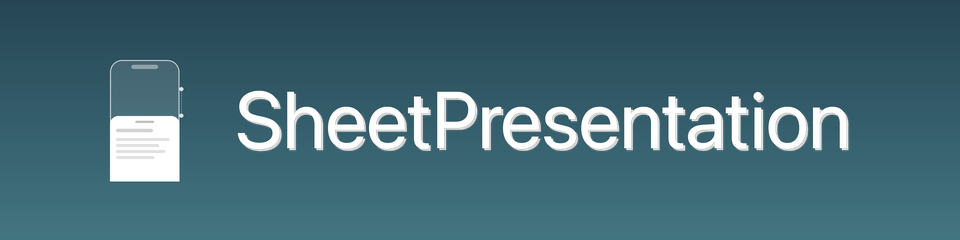

<p align="center">
  
</p>
<p align="center">
  iOS 底部抽屉（Bottom Sheet）展示库，提供多档位、ScrollView 联动、侧滑返回、浮动样式等能力
</p>
<p align="center">
  <a href="https://github.com/SPStore/SheetPresentation"></a>
  <a href="https://swift.org/"></a>
  <a href="https://developer.apple.com/ios/"></a>
  <a href="https://github.com/SPStore/SheetPresentation/blob/main/LICENSE"></a>
  <a href="https://swift.org/package-manager/"></a>
</p>

---

## 特性

- [x] **多档位（Detents）**：支持任意数量的高度档位，内置 `large()`、`medium()`，支持固定高度与动态 resolver 闭包
- [x] **ScrollView 无缝联动**：Sheet 内嵌列表/滚动视图时，手势在 Sheet 拖拽与 ScrollView 滚动之间自动切换，无需额外配置
- [x] **交互式 dismiss**：向下拖过最小档位可交互式关闭，支持速度判断与进度取消
- [x] **侧滑返回**：可选的屏幕边缘 Pan 手势，触发交互式横向 dismiss
- [x] **浮动样式（iOS 26+）**：`prefersFloatingStyle` 开启后四周带圆角与间距，随档位高度动态插值
- [x] **自定义转场动画**：通过 `SheetPresentationControllerTransitionAnimating` 协议注入自定义 present/dismiss 动画
- [x] **背景视觉效果**：`backgroundEffect` 支持 `UIBlurEffect`/`UIGlassEffect`（iOS 26+）或完全透明
- [x] **支持旋转**：横竖屏切换时 Sheet 位置与档位自动重新计算

---

## 系统要求

- iOS 13+
- Swift 5.9+
- Xcode 15+

---

## 安装

### Swift Package Manager

在 Xcode 中选择 **File → Add Package Dependencies**，填入仓库地址，或在 `Package.swift` 中添加：

```swift
dependencies: [
    .package(url: "https://github.com/SPStore/SheetPresentation.git", from: "1.0.0")
]
```

---

## 快速开始

### 最简示例

```swift
import SheetPresentation

// 在任意 UIViewController 中：
let contentVC = MyContentViewController()
sp.presentSheetViewController(contentVC, animated: true)
```

`sp` 是库为 `UIViewController` 提供的命名空间扩展，无需额外配置即可使用默认样式（单档 `large()`）。

### 配置档位

```swift
let contentVC = MyContentViewController()
let sheet = contentVC.sp.sheetPresentationController

sheet.detents = [.large(), .medium()]
sheet.selectedDetentIdentifier = .medium   // 初始显示中档

sp.presentSheetViewController(contentVC, animated: true)
```

### 三档位示例

```swift
let smallID = SheetPresentationController.Detent.Identifier("small")

sheet.detents = [
    .large(),
    .medium(),
    .custom(identifier: smallID) { _ in 220 }
]
sheet.selectedDetentIdentifier = smallID
```

---

## API 概览

### 访问 SheetPresentationController

```swift
// 通过被展示的 VC 访问
let sheet = contentVC.sp.sheetPresentationController

// NavigationController 场景
let sheet = navigationController?.sp.sheetPresentationController
```

### 展示

```swift
// 基础展示
sp.presentSheetViewController(contentVC, animated: true)

// 带 sourceView（iPad Popover）
sp.presentSheetViewController(contentVC, animated: true, sourceView: button)
```

### Detent 配置

```swift
// 内置档位
sheet.detents = [.large()]
sheet.detents = [.large(), .medium()]

// 固定高度
sheet.detents = [
    .custom(identifier: .init("panel")) { _ in 400 }
]

// 动态高度（根据容器尺寸计算）
sheet.detents = [
    .custom(identifier: .init("adaptive")) { ctx in
        ctx.maximumDetentValue * 0.6
    }
]
```

### 动画切换档位

```swift
sheet.animateChanges {
    sheet.selectedDetentIdentifier = .large
}
```

### 外观

| 属性 | 类型 | 默认值 | 说明 |
|------|------|--------|------|
| `preferredCornerRadius` | `CGFloat` | `13` | 圆角半径 |
| `prefersGrabberVisible` | `Bool` | `false` | 顶部手柄 |
| `prefersShadowVisible` | `Bool` | `false` | 投影 |
| `dimmingBackgroundAlpha` | `CGFloat` | `0.4` | 背景遮罩透明度 |
| `backgroundEffect` | `UIVisualEffect?` | `nil` | Sheet 背景模糊/玻璃效果 |
| `prefersFloatingStyle` | `Bool` | `false` | 浮动样式（iOS 26+） |

### 交互行为

| 属性 | 类型 | 默认值 | 说明 |
|------|------|--------|------|
| `allowsTapBackgroundToDismiss` | `Bool` | `true` | 点击背景关闭 |
| `allowsPanGestureToDriveSheet` | `Bool` | `true` | 拖拽手势驱动 Sheet |
| `allowsScrollViewToDriveSheet` | `Bool` | `true` | ScrollView 驱动 Sheet |
| `prefersScrollingExpandsWhenScrolledToEdge` | `Bool` | `true` | 滚到顶端可展开到上一档 |
| `requiresScrollingFromEdgeToDriveSheet` | `Bool` | `false` | 要求从内容顶部开始才能驱动 Sheet |
| `prefersSheetPanOverpullWithDamping` | `Bool` | `false` | 最大档上拉阻尼回弹 |
| `isEdgePanGestureEnabled` | `Bool` | `false` | 侧滑返回手势 |
| `edgePanTriggerDistance` | `CGFloat` | `32` | 侧滑触发边距（pt） |

---

## 进阶用法

### 监听档位变化

```swift
// 让 delegate 实现 SheetPresentationControllerDelegate
class MyViewController: UIViewController, SheetPresentationControllerDelegate {

    func sheetPresentationControllerDidChangeSelectedDetentIdentifier(
        _ sheetPresentationController: SheetPresentationController
    ) {
        print("当前档位：\(sheetPresentationController.selectedDetentIdentifier?.rawValue ?? "-")")
    }
}

// 赋值 delegate
sheet.delegate = self
```

### 禁止关闭（模态锁定）

```swift
contentVC.isModalInPresentation = true
// 配合 delegate 弹提示
func presentationControllerDidAttemptToDismiss(_ presentationController: UIPresentationController) {
    // 弹出确认弹窗
}
```

### 背景模糊效果

```swift
// 使用系统模糊
sheet.backgroundEffect = UIBlurEffect(style: .systemMaterial)

// iOS 26+ 使用玻璃效果
if #available(iOS 26, *) {
    sheet.backgroundEffect = UIGlassEffect()
}

// 无效果（透明背景）
sheet.backgroundEffect = nil
```

### 浮动样式（iOS 26+）

```swift
if #available(iOS 26, *) {
    sheet.prefersFloatingStyle = true
}
```

开启后 Sheet 左右底部带间距，圆角随档位高度动态过渡，适合地图类应用场景。

### 自定义转场动画

让 `delegate` 同时实现 `SheetPresentationControllerTransitionAnimating`：

```swift
extension MyViewController: SheetPresentationControllerTransitionAnimating {

    func animatorForPresentTransition(
        _ sheetPresentationController: SheetPresentationController
    ) -> UIViewControllerAnimatedTransitioning? {
        FadeAnimator(isPresenting: true)
    }

    func animatorForDismissTransition(
        _ sheetPresentationController: SheetPresentationController
    ) -> UIViewControllerAnimatedTransitioning? {
        FadeAnimator(isPresenting: false)
    }
}
```

返回 `nil` 使用库内置动画。交互式 dismiss（拖拽/侧滑）始终使用库内实现。


## License

MIT
